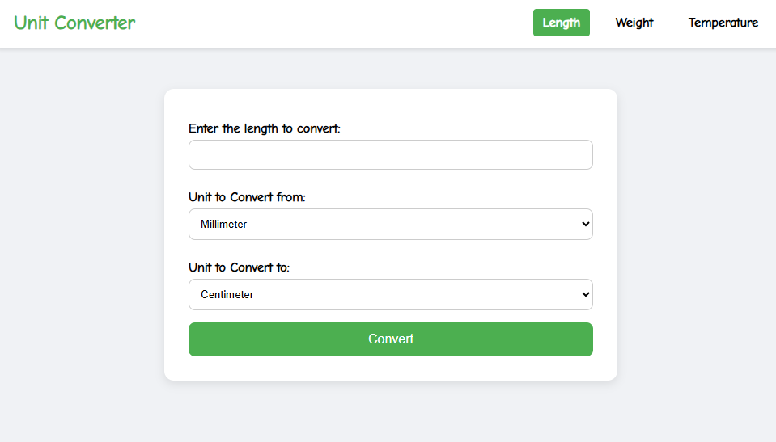
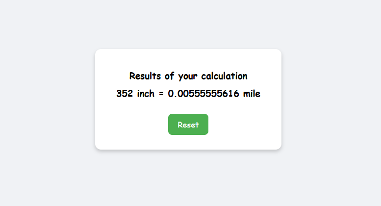

# Unit Converter 🌐

A simple Node.js + Express web application that allows users to convert between different units of Length, Weight, and Temperature.Project idea from: https://roadmap.sh/projects/unit-converter

## Features ✨

- Convert Length units (millimeter, centimeter, meter, kilometer, inch, foot, yard, mile).

- Support for other units like Weight and Temperature (optional extension).

- Forms are submitted to the server and the result is rendered directly.

- Clean and simple structure.

## Technologies Used 🛠

- Node.js

- Express.js

- HTML

- ejs

## How It Works ⚙️

1. User enters a value and selects units to convert on a simple form.

2. The form submits to the same page (target="\_self").

3. The server catches the POST request, calculates the conversion, and sends back a new HTML response with the result.

## Screenshots



---



## Getting Started 🚀

### Prerequisites

`Node.js` installed.

### Installation

```
git clone https://github.com/M-Lenox/unit-converter.git
cd unit-converter
npm install
```

### Running the App

```
npm start
```

Then visit http://localhost:3000/convert-length
